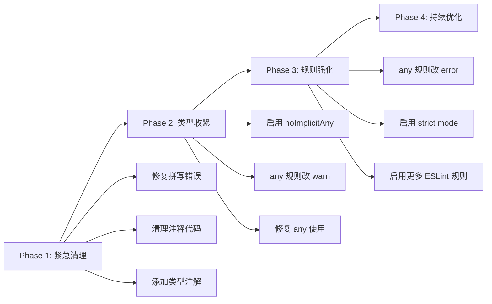

# 配置与构建审计报告

> 审计时间: 2025-12-25 (深度审计更新)
> 模块路径: `build/`, `vite.config.ts`, `tsconfig.json`, `eslint.config.js`

---

## 模块概览

| 文件                | 行数 | 描述                |
| ------------------- | ---- | ------------------- |
| `tsconfig.json`     | 58   | TypeScript 编译配置 |
| `vite.config.ts`    | 77   | Vite 构建配置       |
| `eslint.config.js`  | 174  | ESLint 代码规范配置 |
| `build/plugins.ts`  | 68   | Vite 插件配置       |
| `build/utils.ts`    | 112  | 构建工具函数        |
| `build/cdn.ts`      | ~50  | CDN 加速配置        |
| `build/compress.ts` | ~40  | 压缩插件配置        |
| `build/optimize.ts` | ~40  | 依赖优化配置        |
| `build/info.ts`     | ~50  | 构建信息输出        |

---

## 🔴 严重问题 (高优先级)

### 1. TypeScript 严格模式禁用

**文件**: `tsconfig.json: 6-9`

```json
{
  "compilerOptions": {
    "strict": false, // ❌ 应启用
    "strictNullChecks": true, // ✅ 已启用
    "noImplicitAny": false, // ❌ 应启用
    "strictFunctionTypes": false // ❌ 应启用
  }
}
```

**影响**:

- 无法捕获潜在的类型错误
- `any` 类型可能隐式引入
- 函数参数类型不严格匹配

**建议**: 分阶段启用严格模式

```json
// Phase 1 - 立即
"noImplicitAny": true,

// Phase 2 - 清理 any 后
"strictFunctionTypes": true,

// Phase 3 - 完整启用
"strict": true
```

---

### 2. ESLint 允许 `any` 类型

**文件**: `eslint.config.js: 81`

```javascript
"@typescript-eslint/no-explicit-any": "off"
```

**影响**: 整个项目可自由使用 `any`，类型安全性大打折扣。

**建议**: 逐步收紧

```javascript
// Phase 1 - 警告新代码
"@typescript-eslint/no-explicit-any": "warn"

// Phase 2 - 禁止新增
"@typescript-eslint/no-explicit-any": "error"
```

---

### 3. ~~函数名拼写错误~~ ✅ 已修复

**文件**: `build/utils.ts: 51`

```typescript
const warpperEnv = (envConf: Recordable): ViteEnv => {
  // ❌ "warpperEnv" 应为 "wrapperEnv"
```

**导出确认**: `export { root, pathResolve, alias, __APP_INFO__, warpperEnv, getPackageSize };`

**影响**: 导出名称拼写错误，影响代码可读性，且已在多处使用。

**状态**: ✅ 已修复 - `wrapperEnv` 已添加，`warpperEnv` 保留为兼容导出并标记 `@deprecated`。

---

## 🟡 中等问题 (中优先级)

### 4. ~~缺少参数类型定义~~ ✅ 已修复

**文件**: `build/utils.ts: 84`

```typescript
const getPackageSize = options => {  // ❌ options 缺少类型
  const { folder = "dist", callback, format = true } = options;
```

**建议**:

```typescript
interface GetPackageSizeOptions {
  folder?: string;
  callback: (size: string | number) => void;
  format?: boolean;
}

const getPackageSize = (options: GetPackageSizeOptions): void => {
```

---

### 5. 插件返回类型包含 `null as any`

**文件**: `build/plugins.ts: 63-65`

```typescript
lifecycle === "report"
  ? visualizer({ open: true, brotliSize: true, filename: "report.html" })
  : (null as any); // ❌ 类型断言为 any
```

**建议**: 使用正确的类型或过滤 null 值

```typescript
const plugins = [
  // ... other plugins
  lifecycle === "report"
    ? visualizer({ open: true, brotliSize: true, filename: "report.html" })
    : null
].filter(Boolean) as PluginOption[];
```

---

### 6. 注释代码未清理

**文件**: `build/plugins.ts: 44-49`

```typescript
// mock支持
// vitePluginFakeServer({
//   logger: false,
//   include: "mock",
//   infixName: false,
//   enableProd: true
// }),
```

**文件**: `vite.config.ts: 39-46`

```typescript
// css: {
//   preprocessorOptions: {
//     scss: {
//       api: "modern-compiler"
//       // silenceDeprecations: ["legacy-js-api"]
//     }
//   }
// },
```

**建议**: 删除或使用特性开关替代注释。

---

### 7. 构建警告阈值过高

**文件**: `vite.config.ts: 58`

```typescript
chunkSizeWarningLimit: 4000,  // 4MB
```

**问题**: 默认值为 500KB，4MB 过于宽松，可能掩盖打包问题。

**建议**: 降低阈值并优化代码拆分

```typescript
chunkSizeWarningLimit: 1000,  // 1MB - 更合理的警告阈值
```

---

### 8. 多个 ESLint 规则关闭

**文件**: `eslint.config.js`

```javascript
// TypeScript 规则
"@typescript-eslint/ban-ts-comment": "off",     // 允许 @ts-ignore
"@typescript-eslint/no-empty-function": "off",  // 允许空函数
"@typescript-eslint/no-non-null-assertion": "off",  // 允许 !
"@typescript-eslint/no-unused-expressions": "off",

// Vue 规则
"vue/require-default-prop": "off",
"vue/require-explicit-emits": "off",
"vue/multi-word-component-names": "off",
```

**建议**: 逐步启用这些规则以提高代码质量。

---

## 🟢 低等问题 (低优先级)

### 9. 构建目标较旧

**文件**: `vite.config.ts: 55`

```typescript
target: "es2015",  // 较旧的目标
```

**建议**: 根据实际浏览器支持情况考虑升级

```typescript
target: "es2020",  // 支持更多现代特性
```

---

### 10. 依赖版本说明缺失

**文件**: `.npmrc` 中存在 `allowedDeprecatedVersions`

**建议**: 在 `README.md` 或专门文档中说明为何允许过时依赖。

---

### 11. 代理配置注释

**文件**: `vite.config.ts: 31`

```typescript
proxy: {
  "/api": {
    target: "http://localhost:3000",
    changeOrigin: true
    // rewrite: path => path.replace(/^\/api/, "")
  }
}
```

**问题**: `rewrite` 被注释但保留，不清楚是否需要。

**建议**: 删除或添加配置说明。

---

## 📊 配置健康度评分

| 维度       | 评分     | 说明                                  |
| ---------- | -------- | ------------------------------------- |
| 类型安全   | ⭐⭐     | strict mode 禁用，any 放行            |
| 代码一致性 | ⭐⭐⭐   | 有 ESLint/Prettier，但规则宽松        |
| 构建优化   | ⭐⭐⭐⭐ | CDN、压缩、代码分割都有配置           |
| 可维护性   | ⭐⭐⭐   | 存在拼写错误和注释代码                |
| 安全性     | ⭐⭐⭐   | 删除 console，但 sourcemap 配置需审查 |

---

## 📋 优化建议汇总

| 优先级 | 问题                    | 工作量 | 文件               |
| ------ | ----------------------- | ------ | ------------------ |
| 🔴 高  | 启用 `noImplicitAny`    | 高     | `tsconfig.json`    |
| 🔴 高  | 逐步限制 `any` 使用     | 高     | `eslint.config.js` |
| 🔴 高  | 修复 `warpperEnv` 拼写  | 低     | `build/utils.ts`   |
| 🟡 中  | 添加 `options` 类型定义 | 低     | `build/utils.ts`   |
| 🟡 中  | 移除 `null as any`      | 低     | `build/plugins.ts` |
| 🟡 中  | 清理注释代码            | 低     | 多个文件           |
| 🟡 中  | 降低 chunk 警告阈值     | 低     | `vite.config.ts`   |
| 🟢 低  | 更新构建目标            | 低     | `vite.config.ts`   |
| 🟢 低  | 启用更多 ESLint 规则    | 中     | `eslint.config.js` |

---

## 🔄 推荐的渐进式改进路线


